# 🗺️ MAPA ESTRUCTURAL - SGFIntegral Web App

Este mapa describe la arquitectura de la aplicación **SGFIntegral**, una PWA cooperativa familiar para el registro y gamificación del bienestar.

## 📌 STACK TECNOLÓGICO
- **Core**: Vanilla HTML, CSS (Glassmorphism premium), Javascript ESM.
- **Backend / DB / Auth**: Firebase v10 Modular SDK (Firestore & Auth).
- **Deployment**: GitHub Pages vía GitHub Actions (`.github/workflows/deploy.yml`).
- **Offline / PWA**: Service Worker (`sw.js`) + `manifest.json`.

---

## 📁 ESTRUCTURA DEL CÓDIGO FUENTE

- **`index.html`**
  - Shell principal de la aplicación.
  - Gestión de vistas/pantallas virtuales (`#screen-login`, `#screen-family`, `#screen-app`).
  - Orquestador del estado de la aplicación (`window.app`).
  - Listeners de eventos y suscripciones reactivas a Firestore en tiempo real.

- **`css/style.css`**
  - Sistema de diseño de Glassmorphism Premium.
  - Estilos responsivos optimizados para vista móvil (Apple-UI).

- **`js/` (Módulos ESM)**
  - **`firebase-config.js`**: Credenciales del proyecto Firebase `familia-m`.
  - **`firebase.js`**: Inicialización del SDK modular de Firebase (App, Auth, Firestore).
  - **`auth.js`**: Flujo de inicio de sesión con Google Sign-In y asignación de código familiar.
  - **`db.js`**: CRUD y suscripciones reactivas en tiempo real (`onSnapshot`) para miembros y actividades.
  - **`storage.js`**: Sistema local-first legacy con exportación/importación cifrada con PIN de 6 dígitos.
  - **`data.js`**: Gestión de datos reactivos offline (legacy/fallback).
  - **`gamification.js`**: Motor de lógica pura de negocio (niveles, puntos de pasos/sueño/estrés/energía, vidas).
  - **`ui.js`**: Renderizado de componentes DOM.

---

## 🛡️ ESQUEMA DE BASE DE DATOS (Firestore)

El modelo está organizado bajo sub-colecciones para garantizar el aislamiento familiar:

```mermaid
graph TD
    subgraph Firestore
        F[families / familyId] --> M[members / userId]
        F --> A[activities / activityId]
        F --> W[wellness / docId]
    end
    
    style F fill:#0f172a,stroke:#69f0ae,stroke-width:2px;
    style M fill:#1e293b,stroke:#4fc3f7,stroke-width:1px;
    style A fill:#1e293b,stroke:#f48fb1,stroke-width:1px;
    style W fill:#1e293b,stroke:#ce93d8,stroke-width:1px;
```

### Reglas de Seguridad (`firestore.rules`)
- **Lista blanca (Whitelist)**: Solo los emails `mateo.ou@gmail.com` y `1976Monicagc@dompavolei.com` tienen acceso de lectura/escritura a través de la validación del token de Firebase Auth.
- **Acceso familiar**: Un usuario sólo puede leer los datos de su propia familia si está registrado como miembro de ella (`isMember(familyId)`).

---

## 🔄 PROTOCOLO DE COLABORACIÓN PARALELA (Anti + Hermes)

1. **Ramas de Trabajo**:
   - `main`: Reservada para despliegue final estable en GitHub Pages.
   - Para nuevas features o refactorizaciones, crearemos ramas con prefijo `feature/` o `fix/`.
2. **Sincronización de Memoria**:
   - Actualizar siempre `.agent/memory/00_MAPA_ESTRUCTURAL.md` en caso de cambios estructurales.
   - Sincronizar el estado del proyecto en la memoria global `~/.gemini/MEMORY/15_PROJECT_STATE.md`.
